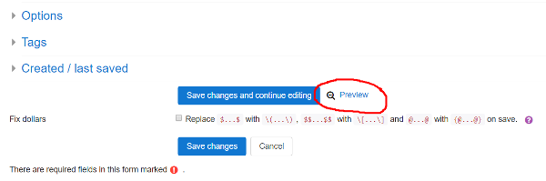

# Authoring quick start 1: a minimal working question

1 - First question | [2 - Question variables](Authoring_quick_start_2.md) | [3 - Feedback](Authoring_quick_start_3.md) | [4 - Randomisation](Authoring_quick_start_4.md) | [5 - Question tests](Authoring_quick_start_5.md) | [6 - Multipart questions](Authoring_quick_start_6.md) | [7 - Simplification](Authoring_quick_start_7.md) | [8 - Quizzes](Authoring_quick_start_8.md)

The authoring quick start guide shows you how to write STACK questions.  Part 1 gets a minimal question working. The following video explains the process:

<iframe width="560" height="315" src="https://www.youtube.com/embed/cpwo-D6EUgA" frameborder="0" allowfullscreen></iframe>
## Before you begin

We assume the following:

1. You have access to a course with STACK installed.
2. You are familiar with simple \(\LaTeX\) formatting for mathematics.  Some basic examples are provided in the [CASText](/Authoring/CASText.md) documentation.

## Creating a minimal STACK question

Go to your Course, navigate to the [question bank](/Moodle/Question_bank.md) and create a new question with the "STACK" question type.

There are lots of fields, but only a few are compulsory:

1. The "question name",
2. The "question text", which is shown to the student,
3. The teacher's "model answer" (inside "Input: ans1" on a default question),
4. A test of "correctness".

By default a new question automatically has one [input](/Authoring/Inputs.md), and one algorithm to test correctness of the answer.

### Question name ###

You must give the question a name, for example `question1`.

### Question text ###

Let's focus on the problem of differentiating \((x-1)^3\) with respect to \(x\). We need to write the question text itself. Copy the following into the Question text box:

	Differentiate \((x-1)^3\) with respect to x.
	[[input:ans1]] [[validation:ans1]]

Notes:

* Moodle has a wide choice for text editors, so the screenshots in this quick start guide might look slightly different to your variant of Moodle.  Also, the cut and paste may or may not include some of the formatting.
* The text contains LaTeX mathematics environments.  Do not use mathematics environments `$..$` and `$$..$$`.  Instead you must use `\(..\)` and `\[..\]` for inline and displayed mathematics respectively.  (There is an automatic bulk converter if you have a lot of legacy materials.)
* Internally the student's answer will be assigned to a variable `ans1`.
* The tag `[[input:ans1]]` denotes the position of the box into which the student puts their answer.
* The tag `[[validation:ans1]]` will be replaced by any feedback related to the validity of the input `ans1`, e.g. syntax errors caused by missing brackets.
* These tags could be positioned anywhere in the question text.

## Input: ans1

Scroll down:  there will be an [inputs](/Authoring/Inputs.md) section of the editing form.  Click on the header `Input: ans1` to reveal the relevant settings.

For a minimal question, we must specify the _model answer_. Let this be

    3*(x-1)^2

Notes

1. The student's response is stored in the answer variable `ans1`.
2. The model answer must be a syntactically valid expression in CAS (Maxima) syntax, not LaTeX. This means multiplication must be explicitly specified, using `*`.
3. [Inputs](/Authoring/Inputs.md) can have a variety of types selected by the  _Input type_ drop-down menu.  The _Algebraic input_ is the default, and what we need here.
4. A question can have many inputs for multiple parts.  These are discussed later in a later part.

## Assessing correctness of a response - the Potential Response Tree (PRT)

Next we have to decide if the student's answer is correct.

To grade the student's response, we need to determine its mathematical properties using an algorithm known as a [potential response tree](/Authoring/Potential_response_trees.md).

By default, a new question contains one [potential response tree](/Authoring/Potential_response_trees.md) called `prt1`.  Feedback generated by the tree replaces the tag `[[feedback:prt1]]` at the appropriate time.

### Configuring a potential response node

A potential response tree is a non-empty acyclic directed graph of _potential response nodes_.  By default, we have one potential response node. At each node

1. `SAns` is compared to `TAns` with the answer test, possibly with an option,
2. If `true`, then we execute the `true` branch,
3. If `false`, then we execute the `false` branch.

Each branch can then

* Assign/update the score,
* Assign formative [feedback](/Authoring/Feedback.md) to the student,
* Leave an [answer note](/Authoring/Potential_response_trees.md#Answer_note) for statistical [reporting](/Authoring/Reporting.md) purposes,
* Continue to the next potential response node, or end the process with `[stop]`.

Let us configure the first node to determine if the student has differentiated correctly.

1. Specify the variable `ans1` in the `SAns` setting.
2. Specify the correct answer in the `TAns` setting: `3*(x-1)^2`.
3. Confirm we have `AlgEquiv` in the _Answer test_ drop-down menu (this is the default).

## Saving the question

Now scroll to the bottom of the page and press `[Save changes and continue editing]`.  If the question fails to save, check carefully for any errors, correct them and save again.

__We now have a minimal question.__

To recap, we have

1. The "question name",
2. The "question text",
3. The teacher's "model answer",
4. A test of "correctness".

Next we should try out our question by pressing the `Preview` link at the bottom of the page.

## Previewing the question

To speed up the testing process, scroll down on the preview window and under either "Attempt options" or "Preview options" (moodle version dependent) make sure you have "How questions behave" set to "Adaptive Mode". If necessary, "Start again with these options". This will allow you to check your answers without having to _Submit_ and _Start again_ repeatedly.

With the preview open, try typing

    3*(x-1)^2

in the answer box. The system first establishes the syntactical validity of this answer.

Press the `[Check]` button.

The system executes the potential response tree and establishes whether your answer is equivalent to the model answer `3*(x-1)^2`.

## Student validation

Notice that there is a two-step process for the student to enter their answer.

First is "validation", and normally servers have "instant validation" enabled.  If the expression is valid, STACK shows the student "Your last answer was interpreted as follows:" and displays their expression.  An invalid response creates an error message. 

The second stage executes when a valid expression is entered, and this evaluates the potential response tree to assess the student's answer.

This two-stage process is a unique and essential feature of STACK.  There are lots of options for validation to help the student.  For example, in the above, all example expressions have strict syntax.  Here we used expressions like `3*(x-1)^2`, with `*` symbols to denote multiplication.  You could choose to let students type in expressions like `3(x-1)^2` and accept implied multiplication. Note, however, that teacher input will always have to be strict to avoid ambiguity. Documentation on these options is given in the [inputs](/Authoring/Inputs.md) section.

# Next step #

You should now be able to write a simple question in STACK.

##### The next part of the authoring quick start guide looks at using [question variables](Authoring_quick_start_2.md).

