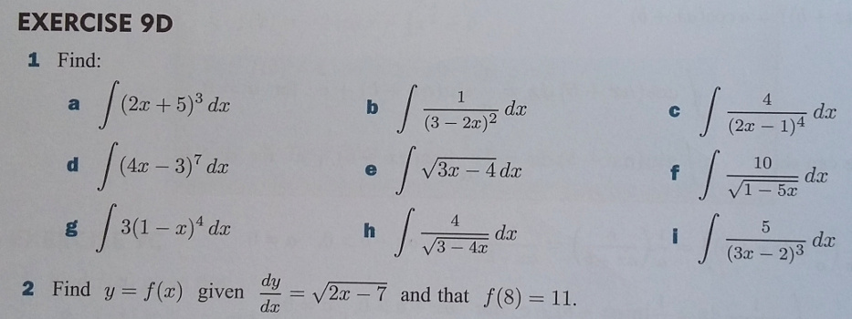

# Authoring quick start 2: question variables

[1 - First question](Authoring_quick_start_1.md) | 2 - Question variables | [3 - Feedback](Authoring_quick_start_3.md) | [4 - Randomisation](Authoring_quick_start_4.md) | [5 - Question tests](Authoring_quick_start_5.md) | [6 - Multipart questions](Authoring_quick_start_6.md) | [7 - Simplification](Authoring_quick_start_7.md) | [8 - Quizzes](Authoring_quick_start_8.md)


This part of the authoring quick start guide deals with using question variables. The following video explains the process:

<iframe width="560" height="315" src="https://www.youtube.com/embed/SFo3MBkyWVQ" frameborder="0" allowfullscreen></iframe>

## Example question

For this example, we will be working with a simple integration problem. Below is a typical set of practice exercises.



(Reproduced with permission from _Advanced Mathematics for AS and A level 2_ (A-level mathematics), Haese Mathematics (2018) [978-1-925489-32-3](http://www.haesemathematics.com/books/advanced-mathematics-2-for-a-level))

Let us focus on the problem of finding \(\int 3(x-1)^{-4} \mathrm{d}x\). Create a new STACK question. As before, we will give our question a **Question name**, say "Integration Example".

### Using question variables

The next steps would be to add question text, and then to add the teacher's answer `-1*(x-1)^(-3)+c` to the `model answer` field and the `potential response tree`.  However, the expression and model answer will normally be referred to more than once, so it is usually easiest to assign them to "question variables" using the optional [question variables](/Authoring/Variables.md#Question_variables) field.

Add the following to the question variables

```
exp: 3*(x-1)^(-4);
ta: int(exp,x)+c;
```

The coding in question variables is based on Maxima, which has an unusual syntax for assignment.  In particular, the colon `:` is used to assign a value to a variable.  So to assign the value of `5` to `a1`, we use the syntax `a1:5`. In general, it is good practice to give variables multi-character names, as single-character names are meant for student input. This is because multi-character variables the author defined cannot by default be input by students. Additionally, adding semicolons to the end of each line is optional, but good practice.

Notice we are using the CAS to determine the model answer by calling the `int()` function to find the anti-derivative. When the CAS determines an anti-derivative, it does not include a constant of integration, so we have to add it ourselves.

Now it will be a lot faster to fill out the rest of the question. Add the following to the question text:

	Find \(\int{@exp@} \mathrm{d}x\)
	[[input:ans1]] [[validation:ans1]]

Notice that we have defined a local variable `exp`, and used the value of this in the Question text. There is a difference between mathematics enclosed between `\(..\)` symbols and `{@..@}` symbols. All the text-based fields in the question, including feedback, are [CAS text](/Authoring/CASText.md).  This is HTML into which mathematics can be inserted.  LaTeX is placed between `\(..\)`s, and CAS expressions (including your variables) between matching `{@..@}` symbols.  The CAS expressions are evaluated in the context of the question variables and displayed as LaTeX.

Since we have used `{@exp@}` here, the user will not see a \(exp\) on the screen when the question is instantiated, but the _displayed value_ of `exp`: \(\frac{3}{(x-1)^{-4}}\)

In the input `ans1`, specify the `model answer` as the variable `ta`.

In the potential response tree, set the `Answer test` to  `AlgEquiv`, set  `SAns` to `ans1` and set `TAns` to `ta`. 

It is good practice to use question variables often, as they save time and let you change properties of the question easily in the future.

# Next step #

You should now be able to use question variables in STACK.

##### The next part of the authoring quick start guide looks at [improving feedback](Authoring_quick_start_3.md).