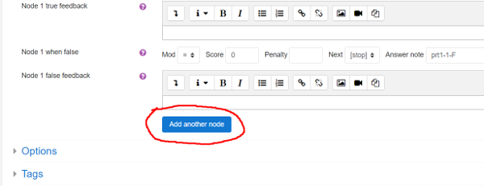

# Authoring quick start 3: improving feedback

[1 - First question](Authoring_quick_start.md) | [2 - Question variables](Authoring_quick_start_2.md) | 3 - Feedback | [4 - Randomisation](Authoring_quick_start_4.md) | [5 - Question tests](Authoring_quick_start_5.md) | [6 - Multipart questions](Authoring_quick_start_6.md) | [7 - Simplification](Authoring_quick_start_7.md) | [8 - Quizzes](Authoring_quick_start_8.md)


This part of the Authoring Quick Start Guide deals with improving feedback. The following video explains the process:

<iframe width="560" height="315" src="https://www.youtube.com/embed/l6QAMmUA5Pk" frameborder="0" allowfullscreen></iframe>
## Introduction

In the last part we started working with question variables. Specifically, we defined the variable  `exp` for the expression to be integrated, and `ta` for the teacher's answer. Then we asked the student to find \(\int 3(x-1)^{-4}dx\).

Try previewing this question and typing in  `-1*(x-1)^(-3)+c`. The system should accept this as correct.  Next type in `-1*(x-1)^(-3)+C`.  This will be compared to the teacher's answer `-1*(x-1)^(-3)+c` by algebraic equivalence (recall we specified `AlgEquiv` in the potential response tree), and will not be accepted as equivalent.  The reason is that `c` and `C` are different.  A reasonable teacher will probably not care which letter is used for the constant of integration. Let us fix this problem.

## Answer test: Int

We will need to edit the potential response tree to use a better [answer test](Answer_tests.md#Int). Return to the page "Editing a STACK question". Find your potential response tree settings, click on the drop-down menu where we selected `AlgEquiv` and select `Int` from the list. Type `x` (the variable) into the Test options setting. Now press the `[Save changes and continue editing]` button and once more click the preview button.  We have just selected a special [answer test](Answer_tests.md) for dealing with integration questions.

The _Int_ answer test will accept any variable name for the constant of integration. For example, try typing in  `-(x-1)^(-3)+k`. The system should accept this as correct.  It will also give standard feedback if the student forgets a constant of integration or accidentally differentiates instead.  To try this, type `-12*(x-1)^(-5)`.  If you don't want students to see the automatic feedback, select the _Quiet_ option in the potential response node.

An outcome's  `Answer Note` is a name given for that specific outcome. STACK will automatically generate these with information on the potential response tree, the node number and the outcome of the node.

## Considerations

When checking a student's answer with STACK, a teacher needs to ask themselves _"What are the mathematical properties that make a student's answer correct/incorrect?"_  In our case, these questions include:

- Is the student's answer a symbolic anti-derivative of the integrand?
- Does the student have a constant of integration in an appropriate form?

The built-in `int` answer test answers these questions, so a teacher does not have to write code to do so for every integration question.

Next, a teacher needs to ask _"What might a student do incorrectly, and what will this give them as an answer?"_  This second question is more difficult. The answer might come through experience or from asking upfront diagnostic questions. It is often sensible to review students' responses to STACK questions after a year and build in better feedback in light of experiences. 

## Enhancing the feedback further

For each mistake we think students might make, we can create an answer test. For example, we might expect students to leave their answer in expanded form. This would of course still be a correct answer, but we want to guide students away from unnecessarily expanding their answer. Let us create another node that tests if the student left their final answer in a factored form. We do this by adding another potential response node. 



Go to the potential response tree and click `[Add another node]` . Then under Node 1's  `True` branch change `Next` to `Node 2`. If we enter Node 2, we know the student has the correct answer and just need to establish if it is factored or not. To establish this we need to use the [FacForm answer test](Answer_tests.md). This tests both that SAns and TAns are equivalent, and that SAns is factored. In this case we already know that the student's answer is equivalent to the teacher's answer (using *Int*'s better tailored algorithm). Hence we can just test the student's answer against itself.

Update the form so that Node 2 has

```
Answer test = FacForm
SAns = strip_int_const(ans1,x)
TAns = strip_int_const(ans1,x)
Test options = x
```

STACK provides a function `strip_int_const` to remove any constant of integration which a student may have used. We again have to specify the variable in `Test options`. 

Make sure that the outcomes for both `True` and `False` do not change the score. By default they will be set to `+0` and `-0`, respectively. By not changing the score, we ensure that students are not penalised for giving their answer in expanded form.

FacForm gives automatic feedback, but if you want to write your own you can set `Quiet` to `Yes` and type something like the following into `Node 2 false feedback`:

```
Your answer is not factored. Well done for getting the correct answer, but remember that there is no need to expand out the brackets.
```

You can continue to expand your potential response tree, checking for as many common mistakes as you would like to. See the [documentation](Answer_tests.md) for information on more answer tests.

## Adding general feedback

`General Feedback` is shown to every student, regardless of whether they got the question right or wrong. This is a good place to add a full worked solution.

# Next step

You should now be able to create specific feedback in STACK.

##### The next part of the authoring quick start guide looks at [randomisation](Authoring_quick_start_4.md).