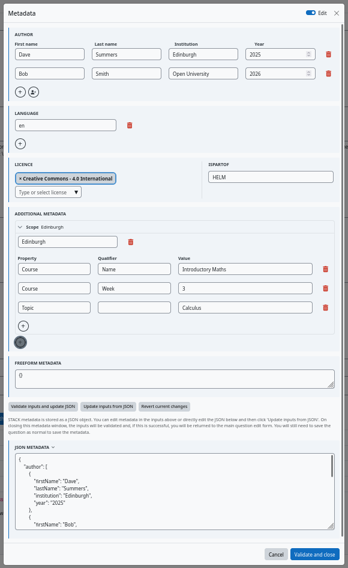

# Question metadata

STACK questions support flexible metadata. Metadata is recorded in JSON format in two database fields - `metadata` and `prescribedmetadata`. The `metadata` field holds user-editable metadata. `prescribedmetadata` is currently empty and is reserved for storage of automatically generated and maintained metadata in the future, including a universal question id and some form of question ancestory. 

New questions will be created with editable `metadata` similar to the following:
```
{
    "author":[
        {
            "firstName": "Current", //$USER->firstname
            "lastName": "User", // $USER->lastname
            "institution": "", // $USER->institution
            "year": "2026" // Current year
        }
    ],
    "language": [
        "en" // Current language
    ],
    "license": "unknown", // $CFG->sitedefaultlicense
    "isPartOf": "",
    "additional": {},
    "freeform" {}
}
```
A question can have multiple authors. 

Additional metadata is stored in Scope->Property->Qualifier->Value or Scope->Property->Value format. Scope identifies the metadata scheme being used. For instance, two institutions might have the property `Level` that has different meanings. Scope allows differentiation between the two:
```
"additional": {
    "Edinburgh": {
        "Level": "Undergraduate"
    },
    "Glasgow": {
        "Level": "Year 2"
    }
}
```
A property within a scope can have qualifiers:
```
"additional": {
    "Edinburgh": {
        "Course": {
            "Name": "Introductory Maths",
            "Week": "3"
        }
    }
}
```
or simply a value:
```
"additional": {
    "Edinburgh": {
        "Course": "Introductory Maths"
    }
}
```
If any entry for a property has a qualifier, then all entries must do so in order for valid JSON to be created:
```
"additional": {
    "Scope1": {
        "Property1": {
            "Qualifier1": "Value1",
            "Qualifier2": "Value2",
            "Qualifier3": [
                "Value3",
                "Value4"
            ]
        },
        "Property2": [
            "Value5",
            "Value6",
            "Value7"
        ],
        "Property3": "Value8"
    },
    "Scope2": {
        "Property1": "Value2",
        "Property4": "Value4"
    }
}
```
The freeform metadata input allows entry of further metadata in whatever format the user requires. It simply has to be valid JSON. This can also be added in the main JSON metadata input field but (unlike `additional` entries) does not create additional input fields and buttons. This field is for power users who require greater nesting depth in their metadata.

All information in the question `metadata` field can be updated via the button 'View and edit full metadata' in the question edit form. This launches a pop-up where the metadata information can be updated via input boxes or the JSON can be manually amended and validated.



Switch the modal to edit, update the input boxes and click 'Validate inputs and update JSON' to display the JSON output. Update the JSON and click 'Update inputs from JSON' to fill in the input boxes from the JSON. 'Validate and close' will take the contents of the input boxes, validate them and then create and store JSON ready to be saved as part of the STACK question. The question edit form must still be saved normally once the pop-up has closed in order to save this JSON to the question.

Please note that although you can update either the JSON or the input boxes, the form saves the contents of the input boxes. If you update the JSON you must click 'Update inputs from JSON' without a JSON error being displayed before clicking 'Validate and close'.

Example metadata:
```
{
    "author": [
        {
            "firstName": "Dave",
            "lastName": "Summers",
            "institution": "Edinburgh",
            "year": "2025"
        },
        {
            "firstName": "Bob",
            "lastName": "Smith",
            "institution": "Open University",
            "year": "2026"
        },
        {
            "firstName": "Tim",
            "lastName": "Jones",
            "institution": "",
            "year": "2026"
        }
    ],
    "language": [
        "en",
        "de"
    ],
    "isPartOf": "HELM",
    "license": "cc-4.0",
    "additional": {
        "Edinburgh": {
            "Course": {
                "Name": "Introductory Maths",
                "Week": "3",
                "Code": [
                    "AA",
                    "BB"
                ]
            },
            "Topic": [
                "Calculus",
                "Geometry",
                "Statistics"
            ],
            "Level": "Undergraduate"
        },
        "HELM": {
            "Workbook": "10",
            "Level": "Basic"
        }
    },
    "freeform": {}
}
```
Both metadata fields are exported and imported normally as part of Moodle XML, allowing automated addition of metadata to large question banks with the aid of Gitsync.
```
<prescribedmetadata>
    {"id": XXXX-XXX-XXXX_XXXX}
</prescribedmetadata>
<metadata>
    {"author":[{"firstName":"Dave","lastName":"Summers","institution":"Edinburgh","year":"2025"},{"firstName":"Bob","lastName":"Smith","institution":"Open University","year":"2026"}],"language":["en"],"isPartOf":"HELM","license":"cc-4.0","additional":{"UoE":{"Course":{"Name":"Introductory Maths","Week":"3"},"Topic":"Calculus"}},"freeform":{}}
</metadata>
```