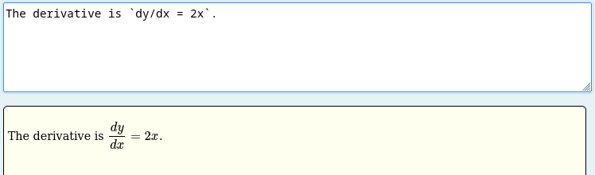
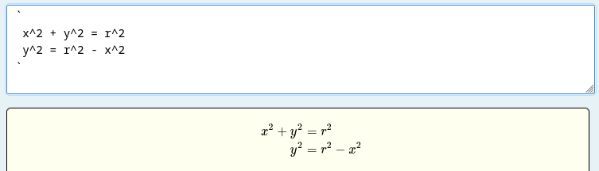
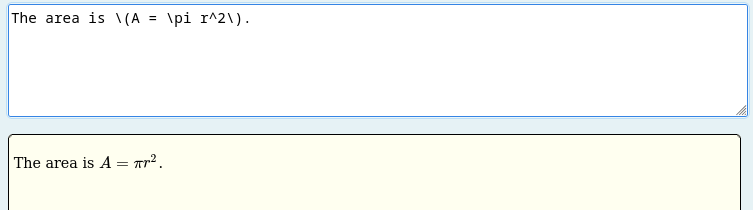
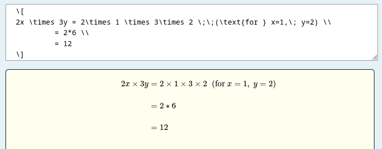
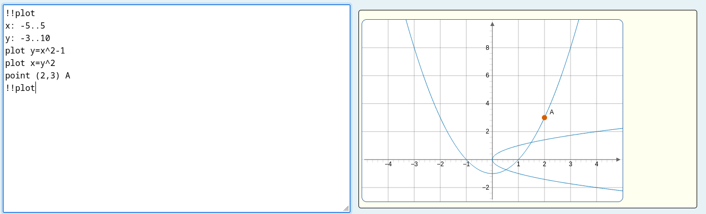

# ASCII block

This block has two purposes:

1. to process and display the contents of a [free-text input](../Inputs/Text_input.md) using client-side Javascript to process text including markdown, AsciiMath and LaTeX (etc).
2. to extract information from the text (as it is processed) and link that to another STACK input.

Examples of how to use this block within complete questions are given in the [free-text specialist tools](../../Specialist_tools/Free_text_input/index.md) documentation.

The `[[ascii]]` castext block takes one or more optional `[[filter]]` child blocks and one or more optional `[[extractor]]` child blocks. This example links free-text input `ans1` to another input `ans2`:

```
[[ascii input="ans1"]]
  [[filter type="markdown" transforms="aligneq" /]]
  [[extractor type="lastexpr" targetinput="ans2" /]]
[[/ascii]]
```
The student's text is run through a markdown filter first which applies normal markdown display formatting.  In this example we also apply a special STACK transformation (`aligneq`) which aligns equations either surrounded by lone backticks or display mode LaTeX (`\[..\]`).

Multiple `[[extractor]]` blocks may be used to [extract answers](ASCII_extractors.md) from the block into multiple STACK inputs. Multiple `[[filter]]` blocks can also be used to translate the raw original input in different ways in succession. By default, the output of one filter is fed into the next filter as the 'raw' input. Extractors are supplied with the raw input and 'map' information from the most recent filter applied. For instance, the markdown filter supplies a list of all the identified occurrences of code and AsciiMath sections in the student's text (in order) and with both the initial contents of the block given to the filter and the transformed output.

Filters and [extractors](ASCII_extractors.md) are applied in the order listed in the `[[ascii]]` block. Filters have the option to break the chain and return to processing the initial raw student input and/or to display the output of the current filter even if there are later filters in the chain (which will thus be used for creating input for extractors, not display).

Currently, it is only possible to link one source input.

### Block parameters

Functionality and styling can be customized through the use of block parameters.

1. `input` (required): string. The name of the free-text input which provides input to this block.
2. `height`: string containing a positive float + a valid CSS unit (e.g. `"480px"`, `"100%"`, ...). Default is `"400px"`. This fixes the height of the display window.
3. `width`: string containing a positive float + a valid CSS unit (e.g. `"480px"`, `"100%"`, ...). Default is `"100%"`. This fixes the width of the display window.
4. `aspect-ratio`: string, containing a positive float. This can be used with `height` _or_ `width` (not both) and automatically determines the value of the unused parameter. An error will occur if values for both `width` and `height` are also set.
5. `hidden`: To hide the display of the contents use the block option `hidden="true"`.

## Filters

Filters control how the student's text input is processed and displayed. If no `[[filter]]` block is provided, the default `markdown-math` behaviour with transform `aligneq` is applied.

A filter is specified with a `[[filter]]` child block inside the `[[ascii]]` block:

```
[[ascii input="ans1"]]
  [[filter type="markdown" transforms="aligneq" /]]
  [[extractor type="lastexpr" targetinput="ans2" /]]
[[/ascii]]
```

***Note: content-less filter blocks must have a closing tag `/`.***

### Filter block parameters

1. `type` (required): the filter type. Currently available: `markdown`, `markdown-math`, `plot`, `plain`, `calculation`, `cas`.
2. `transforms` (for `markdown` type): a comma-separated list of transforms to apply. Available transforms: `aligneq`, `asciimath`, `boldfilter`, `minwrap`.
3. `reset`: if `"true"`, this filter operates on the original raw input rather than the output of any preceding filter(s).
4. `display`: if `"true"`, the output of this filter is used as the final display and subsequent filters cannot modify the display.

### Available filters

#### `markdown-math` filter

This is part of the default behaviour. If you do not specify a filter then `[[filter type="markdown-math" transforms="aligneq" /]]` will be used.

The `markdown-math` filter processes the student's text as markdown and renders mathematical content. The following rendering rules are applied to recognized token types:

- **`code_inline`**: A single backtick expression is treated as inline AsciiMath.  If the content is identified as LaTeX then no processing takes place.  Otherwise, the content is converted to LaTeX.  The result is always wrapped in `\(...\)`.

  ```
  The derivative is `dy/dx = 2x`.
  ```


- **`asciimath_block`**: A backtick on its own line opens a multi-line AsciiMath block; another solitary backtick closes it. If the content is identified as LaTeX then no processing takes place.  Otherwise, each line of content is converted to LaTeX and any configured transforms are applied. The result is wrapped in `\[...\]` if needed.

In the following example, the transform `aligneq` is applied to line up equations on the `=` sign by using LaTeX `begin{align*}` environments.

```
  `
  x^2 + y^2 = r^2
  y^2 = r^2 - x^2
  `
```


- **`math_inline`**: Inline LaTeX delimited by `\(...\)` (identified via the `tex` markdown extension) is passed through as-is and re-wrapped in `\(...\)`.  Note, `$...$` is not supported for inline LaTeX to keep dollar symbols for currency.

  ```
  The area is \(A = \pi r^2\).
  ```


- **`math_block`**: Display LaTeX delimited by `\[...\]` is passed through and any configured transforms are applied.  Note, while our code ignores `$$...$$` as LaTeX delimiters, your local MathJax settings might pick this up and display the contents as mathematics.  In the following example, the transform `aligneq` is applied to line up equations on the `=` sign by using LaTeX `begin{align*}` environments

  ```
  \[
  2x \times 3y = 2\times 1 \times 3\times 2 \;\;(\text{for } x=1,\; y=2) \\
           = 2*6 \\
           = 12
  \]
  ```


Available transforms (specified via the `transforms` parameter):

- `aligneq`: This affects mathematics in the `asciimath_block` and `math_block` (but not inline mathematics). This is intended to automatically align mathematical derivations.  In particular, it formats multiple-line mathematics aligned on the first `=` sign, or similar operators such as inequality. (Shown in math_block and asciimath_block examples above.) The lines of a LaTeX expression are arranged in a 3-column aligned layout:
  - col 1 – leading logical connective, such as implies/therefore symbol (if present, e.g. `=>`, `:.` (therefore) in AsciiMath)
  - col 3 – left-hand side up to (and including) the relation symbol
  - col 4 – the right-hand side

Column 2 is un-used (to right-align the lhs and left-align the rhs) of the main equation.

  A `\text{…}` (that is not `\text{or}`, `\text{and}`, or `\text{if}`) is pushed into a 4th column along with anything which follows it.

There are two internal transformations: `asciimath` and `minwrap`.  The `asciimath` transformation actually parses each expression/line from AsciiMath to LaTeX.  The `minwrap` transformation automatically adds LaTeX mathematics delimiters, e.g. `\(...\)` for inline and `\[...\]` if they are needed (noting some LaTeX maths do not need these), typically at the end of the chain of transformations.  

While you are free to specify these transformations, the `markdown-math` filter ensures they are used, typically at the start and end.  For full control you can specify these transformations using the `markdown` filter below.  (In the future, other transformations may need to come before `asciimath`, for example).

- `boldfilter`: Changes each mathematical expression to bold. Must be applied after `aligneq` (use `transforms="aligneq,boldfilter"`). This is a temporary addition for testing purposes.

#### `markdown` filter

This processes the text as (plain) markdown, without the mathematical extensions above.  You can add any of the transforms as arguments, but the following will treat the text as markdown, without processing any of the AsciiMath (as is done by `markdown-math`

    [[filter type="markdown" /]]

Note that the following are equivalent

    [[filter type="markdown" transforms="asciimath,minwrap" /]]
    [[filter type="markdown-math" /]]

The default behaviour when no filter is present is

    [[filter type="markdown" transforms="asciimath,aligneq,minwrap" /]]

This filter will be applied before any extractors you specify if you do not explicitly include a filter in your ASCII block.

Note, many of the extractor blocks require the identification of mathematics.  This is done within the markdown filter. If you use another filter (e.g. `calculation`) no markdown filter will be added automatically - you will need to specify one yourself if required.

#### `plain` filter

If you use this filter then the text is not processed as markdown.

    [[filter type="plain" /]]

This is used to switch off the default behaviour of adding markdown.

Note, many of the extractor blocks require the identification of mathematics.  These include `lastexpr`, and `lastblock`, which will not function without the markdown filter of some kind being used.


#### `calculation` and `cas` filters

The `calculation` filter provides a simple scientific calculator.  The filter finds text enclosed between `{@...@}` tags on a single line and evaluates the contents using [https://mathjs.org/](https://mathjs.org/). For example, `The answer to \(1+1={@1+1@}\).` displays the answer as 2. The enclosed text is also collected as a block and available to the `lastcalc` extractor.

    [[filter type="calculation" /]]

See the [Filter: calculations](Filter_calculations.md) documentation for full details.

### Filter developer notes

Filters are defined in `corsscripts/ascii/filters`. This has been designed to add flexibility for filtering.  Markdown transforms and associated shared functions are in `corsscripts/ascii/markdownittransforms`. Markdown extensions for identifying additional document sections are in `corsscripts/ascii/markdownitextensions`. The rules for how to display these sections are in `corsscripts/ascii/filters/markdownitrules.js`.

## Plot blocks

Students can include simple graphs in their free-text response using a `!!p` block. Plot blocks are identified by the `plot` filter. If you want to use plot blocks, add the `plot` filter explicitly before the markdown filter.

    [[filter type="plot" /]]
    [[filter type="markdown-math" /]]

The opening and closing markers must each be on a line by themselves.

```
!!p
x: -5..5
y: -3..10
plot y=x^2-1
plot x=y^2
point (2,3) A
fit line (1,2), (2,4), (3,5) as trend
!!p
```


Blank lines are ignored. Lines starting with `#` are comments.

### Plot ranges

The visible graph window can be set with `x: a..b` and `y: c..d`.

```
x: -5..5
y: -3..10
```

If ranges are not specified, both axes default to `-10..10`. The first value must be smaller than the second value.

### Curves

Curves can be entered as `y` as a function of `x`.

```
plot y=x^2
y=sin(x)
f(x)=x^2-1
x^2+1
```

A bare expression is treated as shorthand for `plot y=...`.

Curves can also be entered as `x` as a function of `y`.

```
plot x=y^2
x=sqrt(y)
```

An optional label can be added using `as`.

```
plot y=x^2 as parabola
plot x=y^2 as sideways parabola
```

### Points

Points can be added with `point (x,y)`. Any text after the coordinates is used as the point label.

```
point (2,3)
point (-1,4) A
```

### Data points with a fitted curve

A set of data points can be plotted with a least-squares curve fitted to them.

```
fit line (1,2), (2,4), (3,5)
fit line (1,2), (2,4), (3,5) as trend
fit quadratic (0,1), (1,4), (2,9) as curve
fit cubic (0,1), (1,2), (2,5), (3,10) as curve
fit polynomial 4 (0,1), (1,2), (2,5), (3,10), (4,17) as curve
```

The command adds the data points to the graph and plots the fitted curve. The optional text after `as` is used as the label for the fitted curve.

If an `x` or `y` range is not set explicitly, the default range is expanded as needed to show all the supplied data points.

For a straight line, the compact forms `fitline` and `linefit` are also accepted.

```
fitline (1,2), (2,4), (3,5)
linefit (1,2), (2,4), (3,5)
```

The highest polynomial degree accepted is 6. A polynomial fit of degree `n` needs at least `n+1` data points. A fit cannot be calculated if the supplied points do not determine the requested model, for example if all the points have the same `x` value.

### Axes and grid

Axes and grid are shown by default. They can be switched on or off.

```
axes
no axes
grid
no grid
```

### Size

The size of the plot can be set in pixels.

```
width: 600
height: 350
```

Width and height values are limited to between `100` and `1200`.

### Allowed expressions

Plot expressions may use numbers, variables, brackets, and the following operators.

```
+  -  *  /  ^
```

The following functions are allowed.

```
sin, cos, tan
asin, acos, atan
sqrt
log, log10
exp
abs
floor, ceil, round
mod
min, max
```

A plot block must contain at least one curve or point.
