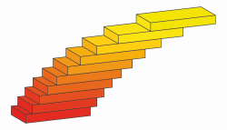

# STACK User Documentation

User documentation is written in an extended implementation of the markup language
[MarkDown](http://daringfireball.net/projects/markdown/). This page is intended
for people wishing to write, edit and translate the documentation.

## Markdown language

* The [markdown](http://daringfireball.net/projects/markdown/) project external site.
* [A cheat sheet](http://scottboms.com/-/downloads/documentation/markdown_cheatsheet.pdf) is available for quick reference.

**Warning:** markdown uses whitespace and formatting to give meaning.  The number of spaces at the beginning and the ends of lines convey specific meaning in markdown.  An example is the way code blocks are included, which is useful for including fragments of Maxima code.

## STACK's markdown documentation system

STACK stores all documentation within language subdirectories.  For example, English is within `/doc/en/`.

* The directory structure forms the structure of the documentation.
* Files must use the `.md` extension.
* Links to files must use the `.md` extension.
* File and directory names should be safe for urls and will be used as the document's title.
  Spaces can be encoded as underscore `_`, e.g. Question state caching should be named `Question_state_caching.md`
* When accessing a directory, the file `index.md` in that directory will be displayed, hence this file should be created for new directories.
  Note `index.md` will never be displayed in a directory listing, it can be accessed by navigating to the directory itself.
* Directories may be nested.
* A directory listing will be appended to the site map when rendered.
* Metadata about the files is stored in `meta_en.json`.  Every page should have metadata.

## How relative links work in STACK's documentation##

**Note** Links in the documentation are relative. You can use the following standard notation, for:

1. a document in the current directory simply use the filename e.g. `[Link to Article](Article.md)`
2. the current directory use `./` e.g.
   * `./Article.md` refers to `Article` in this directory
   * `./#reference` refers to the index of the current directory scrolled to the heading with id `reference`
3. the parent directory use `../` e.g.
   * `../` refers to the docs homepage (if currently only one tier deep)
   * `../Category/Article.md` refers to `Article.md` in the `Category` in the parent directory.

## Conventions in authoring pages

Markdown does not have *categories* in the way that MediaWiki does.  Instead, we strongly encourage authors to include a `# See also` section at the end of *each* STACK documentation page.  This should be part of the markdown page.

## Adding images and files to the documentation

The directory `/doc/content/` is for static content which is served by the documentation.
If you want to serve content from the docs please place it in this directory.

When writing links use direct relative links to

    $CFG->wwwroot . "/question/type/stack/doc/content";

E.g. in `About/Logo.md` use

    

The text in square brackets is the alt text, which is important for visually impaired users reading the documentation. There are many great [guides for writing good alt text](https://webaim.org/techniques/alttext/).

## Adding a link to video in the documentation

To embed video into the documentation first find the unique video key, `VIDEO-KEY`, then then modify

    

For example, `cpwo-D6EUgA`, gives

    

The following rendered markdown:

## Embed video in the documentation

Using an iframe such as

    <iframe width="560" height="315" src="https://www.youtube.com/embed/cpwo-D6EUgA" frameborder="0" allowfullscreen></iframe>

Gives

<iframe width="560" height="315" src="https://www.youtube.com/embed/cpwo-D6EUgA" frameborder="0" allowfullscreen></iframe>

## Mathematics

For the purpose of rendering mathematical equations, an [extended version](https://github.com/drdrang/php-markdown-extra-math) of [PHP Markdown Extra](http://michelf.com/projects/php-markdown/extra/) is used.

It uses LaTeX style notation `\(` and `\[` to write inline and display maths respectively. Fortunately GitHub documentation uses the same notation :D.
An example:

    \[ \frac{\int_a^b f(t) \textrm{d} t }{b - a} \]

\[ \frac{\int_a^b f(t) \textrm{d} t}{b - a} \]

## Compatibility with the online docs {#Website}

The STACK docs are made available online on [docs.stack-assessment.org](https://docs.stack-assessment.org). For more information on how this is achieved, see the [Website documentation](Website.md). However this places certain limitations on the sort of elements that can be included in the documentation:

* You can only have relative links to files within the `doc` directory. This means you should not link relatively to, for example, one of the stack .php files. If you want to demonstrate a behaviour of one of STACKs files, it is better to do a direct link to that file on GitHub or on the STACK demo.
* You cannot use HTML text areas to display LaTeX Math, as that will display poorly. Please use multiline code blocks instead.

# Examples {#Examples}

### Paragraphs and formatting

Paragraphs are made with two new line characters, a single new line will not be rendered:

    This is in a paragraph,
    so is this
    
    This is a new paragraph
    
    This is a **bold** word and this is an *italicised* word.

This is in a paragraph,
so is this

This is a new paragraph

This is a **bold** word and this is an *italicised* word.

### Headings

Headings are indicated by the # symbol

    # Huge
    ## Quite huge
    ### Not so huge
    #### Barely huge

# Huge
## Quite huge
### Not so huge
#### Barely huge

### Lists

Ordered (numbered) and unordered lists are very intuitive, and nesting is easy

    1. first point
    2. second point, which is so long
       it needs two lines
    3. third point will demonstrate nesting
       1. Nested
       2. Lists
    
    * Unordered lists made my stars
    * You can nest with different styles
      1. See?

1. first point
2. second point, which is so long
   it needs two lines
3. third point will demonstrate nesting
   1. Nested
   2. Lists

* Unordered lists made my stars
* You can nest with different styles
  1. See?

### Code (monospace)

Code can be displayed inline using back ticks \`content\` to display `content`. Code can be displayed in a block by indenting:

        Block style code

Will display

    Block style code

### Links

Links are written `[text](Documentation.md)` to give [text](Documentation.md).

They must end with the `.md` extension.  External links are easily generated using

    <http://sesamestreet.com>

gives <http://sesamestreet.com>,
email address work similarly

    <count@sesamestreet.com>

gives <count@sesamestreet.com>.

### Other cool features

    Definition lists
    : Are one of the many cool features available
    They are useful for
    : Dictionary style entries

Definition lists
: Are one of the many cool features available

They are useful for
: Dictionary style entries

To force block style code write `~~~~` above and below, good for after a list when indentation will be interpreted as part of the list

    ~~~~~~~~~~
    Like this
    ~~~~~~~~~~

    > When quoting the syntax is like in emails.

> When quoting the syntax is like in emails.

    Tables       | are also
    ------------ | --------
    an extremely | useful
    feature      | !

Tables       | are also
------------ | --------
an extremely | useful
feature      | !

# See also
* [MarkDown](http://daringfireball.net/projects/markdown/)
* [PHP Markdown Extra](http://michelf.com/projects/php-markdown/extra/)
* [PHP Markdown Extra Math](https://github.com/drdrang/php-markdown-extra-math)
