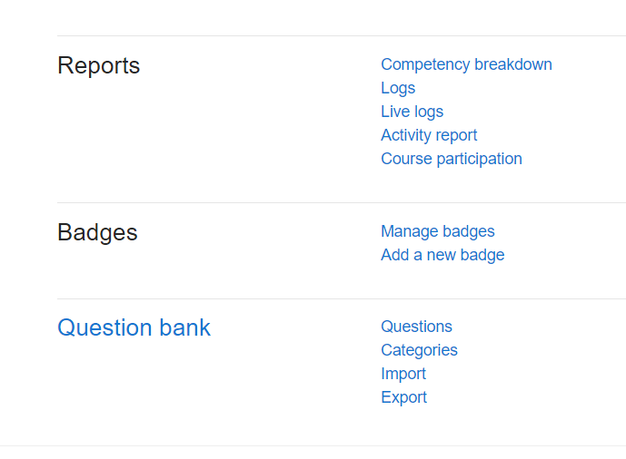
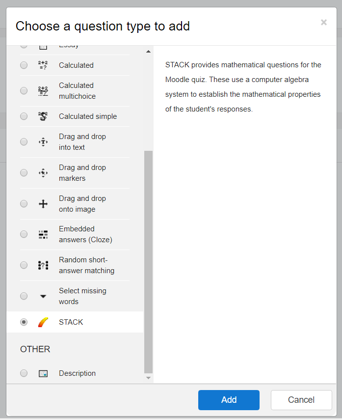

# How do I find the Moodle question bank?

To find the STACK questions login as a teacher.

To begin, go to Moodle and navigate to your course's *Course administration* page and, from the *Question bank* section, click on *Questions*:

On the Question Bank page, press the 'Create new question' button:

From the 'Choose a question type to add' dialog select 'STACK' and press 'Add':

The 'Editing a STACK question' page is displayed. Now we can begin to create the actual question. Don't be put off by the amount of configuration options as, in order to get started, there are only a few we need to worry about.
