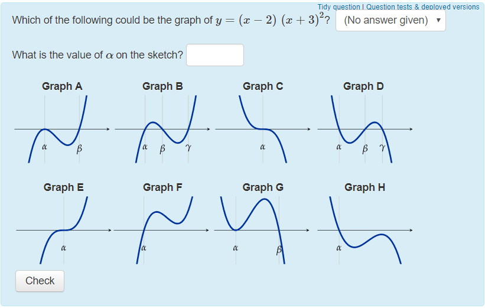

# Curve sketching

At its core, STACK is built to take algebraic input from students. This makes assessing skills regarding curve sketching difficult to implement. This page will take a look at how people have assessed curve sketching in STACK, including some promising projects and alternatives.

## GeoGebra

GeoGebra is a flexible tool for creating a large number of interactive math applets. Applets like [this one](<https://www.geogebra.org/m/xDx295Wu>) (by pirsquared) show that GeoGebra is capable of creating applets that assess at least some competencies of curve sketching (in this case, finding axis intersects).

GeoGebra has a strong user base and there is a large number of user-created resources that can be used in a course. These can then easily be embedded in a STACK question with an `<iframe>` environment. Please note that the [GeoGebra's license](https://www.geogebra.org/license) does not match the [STACK licence](https://github.com/maths/moodle-qtype_stack/blob/master/COPYING.txt).

## JSXGraph

STACK has native support for the mathematics visualisation system [JSXGraph](../Authoring/JSXGraph.md). Recently, there have been attempts to use JSXGraph to assess curve sketching in STACK. In particular, see the work done by Tobias Mai and Alexander Meyer in developing a JSXGraph applet that lets students sketch curves by a trace of points. The applet can determine how accurate the sketch is and provide specific feedback. Future developments include support for randomisation and interface improvements. More information, including contact information, can be found in their paper ["Sketching functions as a digital task with automated feedback"](https://docs.stack-assessment.org/content/2018-proceedings/mai_tobias_2019_2582427.pdf).

## Alternatives to curve sketching

What are the competencies that teachers are looking for when they want to test curve sketching? The answer is not clear. When teaching students about polynomials, let's say you want to give a student a function and ensure they can identify x and y-intercepts, stationary points and the general shapes of its curve. There are ways to assess these competencies without using curve sketching, for example by a [multiple choice question](../Authoring/Multiple_choice_questions.md) like the one below, from "Fundamentals of Algebra and Calculus". However, note the limitations of MCQ's as discussed in [Philosophy of STACK](../About/The_philosophy_of_STACK.md).

## Contributing

We are eager to find a solid way of assessing this competency in STACK. We would appreciate any contributions that help solve this problem. Please [contact the developers](mailto:C.J.Sangwin@ed.ac.uk).