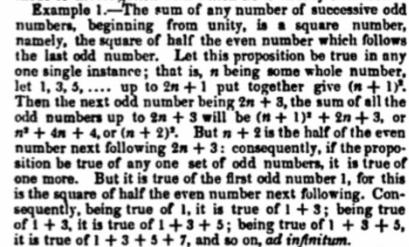

# Support for proof in STACK

In STACK the basic assumption is that a student's answer will be a mathematical expression, e.g. a polynomial or an equation.  While the facilities for assessing a student's free-form proof is limited (in any online assessment system), teachers can create materials for assessing students' understanding of proof in general, and of particular mathematical proofs.

Simple algebraic [reasoning by equivalence](../../Specialist_tools/Equivalence_reasoning/index.md) is a simple/early form of proof, but not what most people think of as "proof".

A discussion of [_Practical Online Assessment of Mathematical Proof_](https://www.tandfonline.com/doi/abs/10.1080/0020739X.2021.1896813) was given by Sangwin, C.J. and Bickerton, R. (2023), International Journal of Mathematical Education in Science and Technology}, 53(10) doi:10.1080/0020739X.2021.1896813.  This included more structured questions making use of

* faded worked examples,
* reading comprehension questions.
* Fill in the blanks.  E.g. in the question library see `Topics/LinearAlgebra/Diagonalizable-proof-comprehension.xml`.

Such questions can be written in STACK.  In addition 

1. The topics page on [using Parson's problems](../../Specialist_tools/Drag_and_drop/Parsons.md) to assess proof.
2. Reference documentation on [CAS libraries for representing text-based proofs](Proof_CAS_library.md).
3. Reference documentation on [CSS Styles for displaying proof](Proof_styles.md).
4. Advice on workflow for [authoring Parson's problems](Proof_Parsons_workflow.md).

Colleagues assessing proof might also consider [semi-automatic marking](../../Moodle/Semi-automatic_Marking.md).

## The nature of mathematical proof

Mathematical writing, especially for students, commonly takes two forms.

1. A mathematical proof, which is a deductive justification of a claim.  A proof is a "checkable record of reasoning".
2. A mathematical recipe, which is a set of instructions for carrying out a procedure.

## Presentation of proof in STACK

STACK supports representation and display of mathematical proof as trees, with string nodes for the individual sentences/clauses in the proof.  The goals of representing proofs as trees of text-based strings are as follows.

1. Manage strings forming part of a traditional written proof;
2. Separate the macro tree-structure of the proof from the details of each step.
3. Separate the content from presentation (following well-established principles in both LaTeX and HTML).
4. Separate the content from justification, explanation and narrative.
5. Help teachers present proof in a consistent way within their course.
6. Make it simpler for teachers to write correct proofs.
7. Provide mechanisms for dynamically altering the level of detail, e.g. hiding or revealing steps and narrative.
8. Provide mechanisms for assessing solutions to [Parson's problems](../../Specialist_tools/Drag_and_drop/index.md) and provide feedback to students.

The goals do not include automatic proof checking.

By separating out these issues we provide more control, and wider opportunities for choice in when and how to generate the right level of cognitive load for students. Traditional presentation of proofs often confound all these issues, confusing students.

# Case study: proof by induction

Consider the following theorem:  \(\sum_{k=1}^n (2k-1) = 1+3+5+\cdots + (2n-1) = n^2\).
A traditional proof is shown below. This proof was published by DeMorgan in 1838.  According to Cajori (1918) this is the first use of the name "mathematical induction", although DeMorgan calls it "successive induction".

> The sum of any number of successive odd numbers, beginning from unity, is a square number, namely the square of half the even number which follows the last odd number.
> Let this proposition be true in any one single instance; that is, \(n\) being some whole number, let \(1,\, 3,\, 5,\, \ldots\) up to \(2n+1\) put together give \((n+1)^2\).
> Then the next odd number being \(2n+3\), the sum of all the odd numbers up to \(2n+3\) will be \((n+1)^2+2n+3\), or \(n^2+4n+4\), or \((n+2)^2\).  But \(n+2\) is half of the even number next following \(2n+3\): consequently, if the proposition be true of any one set of odd numbers, it is true of one more.  But it is true of the first odd number \(1\), for this is the square of half the even number next following.  Consequently, being true of \(1\), it is true of \(1+3\); being true of \(1+3\), it is true of \(1+3+5\); being true of \(1+3+5\), it is true of \(1+3+5+7\), and so on, {\em ad infinitum}.</p>

This is the original version.



This proof is dense, difficult to read and lacks structure.  Since DeMorgan's day, proof by induction is a slightly more formal method of proof consisting of four parts, (i) a statement to be proved, (ii) a base case, (iii) the induction step, and (iv) the conclusion.  Here is a modern version.

> Let \(P(n)\) be the statement "\(\sum_{k=1}^n (2k-1) = n^2\)".
> 
> Since \(\sum_{k=1}^1 (2k-1) = 1 = 1^2\) we see \(P(1)\) is true.
> 
> Assume \(P(n)\) is true. Then
> \[ \sum_{k=1}^{n+1} (2k-1) = \sum_{k=1}^n (2k-1) + (2(n+1)-1) = n^2 + 2n +1 = (n+1)^2.\]
> Hence \(P(n+1)\) is true.
>
> Since \(P(1)\) is true and \(P(n+1)\) follows from \(P(n)\) we conclude that \(P(n)\) is true for all \(n\) by the principle of mathematical induction.

The above proof contains all the detail, and an expert might choose to omit some of the formality and abbreviate the proof.  This is an example of the expert-reversal affect.  However, it is still written in paragraph mode, we could do a lot more to highlight the structure using styles, e.g.

To represent this proof in STACK we define the following

````
proof_steps: [
    ["defn_p",     "Let \\(P(n)\\) be the statement \"\\(\\sum_{k=1}^n (2k-1) = n^2\\)\"."],

    ["base_hyp",   "Note that \\(\\sum_{k=1}^1 (2k-1) = 1 = 1^2\\)"],
    ["base_conc",  "Hence \\(P(1)\\) is true."],

    ["ind_hyp",    "Assume \\(P(n)\\) is true."],
    ["ind_1",      "Then \\(\\sum_{k=1}^{n+1} (2k-1)\\)"],
    ["ind_2",      "\\( = \\sum_{k=1}^n (2k-1) + (2(n+1)-1)\\)"],
    ["ind_3",      "\\( = n^2 + 2n +1 = (n+1)^2.\\)"],
    ["ind_conc",   "Hence \\(P(n+1)\\) is true."],

    ["concp",      "Since \\(P(1)\\) is true and \\(P(n+1)\\) follows from \\(P(n)\\) we conclude that \\(P(n)\\) is true for all \\(n\\) by the principle of mathematical induction."]
];

/****************************************************************/
P0:proof_ind(1,proof(2,3),proof(5,6,7,8),9);
P1:proof_ind("defn_p",proof("base_hyp","base_conc"),proof("ind_1","ind_2","ind_3","ind_conc"),"concp");
````

Note that the variable `proof_steps` is a _list_ of lists:  `[ ["key", "step"], ...`

1. The first element is a `key`. This is a string, or integer, which is used to refer to the `step`.
2. The `key` can be an integer position in the proof_steps, a string `key`, or a string.
3. The variables `P0` and `P1` represent the proof structure. `proof_ind` represents a proof by induction.  Notice the base case and induction steps are themselves `proof` representations, giving identity to these blocks.

See the reference documentation on [CAS libraries for representing text-based proofs](Proof_CAS_library.md) for more types of proofs and functions for dealing with them.

